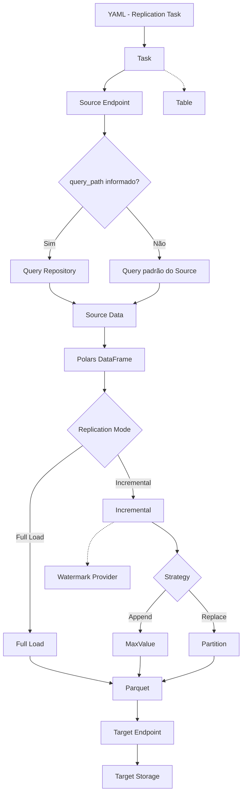

# Fluxo de Execução

O fluxo principal de uma tarefa de replicação pode ser representado da seguinte forma:




# Source Endpoints

O METRO inicialmente será projetado para trabalhar com **SGBDs SQL e NoSQL** como fontes.

Exemplos:

```text
Source Endpoint
│
├── SQL
│   ├── PostgreSQL
│   ├── SQL Server
│   └── Oracle
│
└── NoSQL
    └── MongoDB
```

A implementação específica do Source é responsável por:

- conexão;
- autenticação;
- execução da consulta;
- paginação quando necessária;
- resolução de `query_path`;
- obtenção dos dados;
- conversão dos dados para Polars.

O METRO não é responsável por compreender ou transformar internamente a estrutura de um documento NoSQL.

# Target Endpoints

O Target representa o destino onde os dados serão materializados.

A primeira versão terá suporte a:

```text
Target Endpoint
│
├── S3
└── Local
```

Outros storages poderão ser adicionados posteriormente sem alterar o core de replicação.

O formato de persistência utilizado pelo METRO será **Parquet**.

# Polars

O **Polars** será o núcleo utilizado para representação e processamento dos datasets dentro do METRO.

O fluxo conceitual é:

```text
Source
  ↓
Source Data
  ↓
Polars DataFrame
  ↓
Replication
  ↓
Parquet
```

O METRO não utilizará conceitos como `Row` ou `Document` como entidades do domínio.

Da mesma forma, diferenças entre modelos SQL e NoSQL não serão artificialmente abstraídas pelo core.

Uma fonte NoSQL, por exemplo, poderá utilizar seu próprio mecanismo de consulta para transformar ou explodir documentos antes que os dados sejam entregues ao METRO.

# Table

Apesar de o METRO suportar fontes NoSQL, o conceito de `Table` será mantido como parte do domínio.

Ele representa principalmente **identidade e metadados do dataset**, e não a representação física de cada registro. Metadados de colunas ficam a cargo do Source Endpoint (ex.: `information_schema` em fontes SQL).

```text
Table
│
├── schema
├── name
├── target_schema_name
└── target_name
```

No caso de uma fonte NoSQL, a `Table` pode representar logicamente uma Collection, enquanto o Source Endpoint permanece responsável pelas particularidades da fonte.

# Query Path

O METRO permite que a consulta utilizada pelo Source seja definida externamente ao YAML.

O YAML contém apenas uma referência:

```yaml
source:
  type: postgresql
  runtime: customer_postgres_database
  query_path: orders.sql
```

ou:

```yaml
source:
  type: mongodb
  runtime: customer_mongodb_database
  query_path: orders.js
```

O conteúdo da consulta não é armazenado diretamente no contrato de replicação.

O `query_path` é resolvido pelo **Query Repository**:

```text
YAML
 │
 │ query_path: orders.sql
 ▼
Query Repository
 │
 ├── Local
 │
 └── S3
 │
 ▼
orders.sql
 │
 ▼
Source Endpoint
```

O local onde os arquivos de consulta são armazenados é uma configuração do próprio METRO, e não da tarefa de replicação.

Isso permite que:

- PostgreSQL utilize arquivos `.sql`;
- MongoDB utilize arquivos `.js`;
- consultas complexas sejam mantidas fora do YAML;
- transformações específicas de NoSQL sejam realizadas pela própria consulta;
- o core do METRO permaneça agnóstico ao modelo de dados da fonte.


# Replication Strategies

A replicação é dividida em dois grandes modos:

```text
Replication Strategy
│
├── Full Load
│
└── Incremental
    │
    ├── Append
    │   └── MaxValue
    │
    └── Replace
        └── Partition
```


## Full Load

O **Full Load** realiza a ingestão completa do dataset.

```text
Source
  ↓
Polars
  ↓
Parquet
  ↓
Target
```


## Incremental — Append / MaxValue

A estratégia `Append` utiliza uma coluna de referência para identificar novos dados.

Exemplos de colunas:

```text
created_at
updated_at
id
sequence
```

O METRO determina o maior valor existente (`MAX(reference_column)`) e utiliza esse valor como watermark para a próxima execução.

Exemplo:

```yaml
replication:
  mode: incremental

  strategy:
    type: append
    reference_column: updated_at
```

Fluxo de execução:

1. **Primeira execução** (sem watermark):
   - Extrai dataset completo
   - Cria watermark inicial
   - Escreve dataset via `commit_staging()`

2. **Execuções subsequentes**:
   - Consulta watermark atual via WatermarkClient
   - Aplica filtro `WHERE reference_column > watermark`
   - Acrescenta novos dados via `commit_append_staging()`
   - Atualiza watermark **somente após commit bem-sucedido**


## Incremental — Replace / Partition

A estratégia `Replace` permite reconstruir uma ou mais partições do dataset.

Por exemplo:

```text
orders/
├── year=2024/
├── year=2025/
└── year=2026/
```

Caso a partição de 2026 precise ser reconstruída:

```text
1. Identificar a partição
2. Remover os objetos correspondentes
3. Realizar nova extração
4. Gerar novos Parquet
5. Gravar novamente a partição
```

Exemplo:

```yaml
replication:
  mode: incremental

  strategy:
    type: replace
    reference_column: created_at
    lookback_periods: 3

    partition:
      type: year
```


## Particionamento Hive

Todos os **3 modos de replicação** suportam particionamento Hive temporal opcional:

### Full Load com particionamento

```yaml
replication:
  mode: full
  partition:
    type: month
    reference_column: order_date
```

Layout de saída:

```text
local/raw/orders/
├── month=01/
│   └── part_0001.parquet
├── month=02/
│   └── part_0001.parquet
└── month=03/
    └── part_0001.parquet
```

### Incremental Replace com particionamento

```yaml
replication:
  mode: incremental
  strategy:
    type: replace
    reference_column: last_update
    lookback_periods: 3
    partition:
      type: year
```

- Particionamento é **obrigatório** para Replace
- `lookback_periods` determina quantas partições serão substituídas

### Incremental Append com particionamento

```yaml
replication:
  mode: incremental
  strategy:
    type: append
    reference_column: created_at
    partition:
      type: day
      reference_column: created_at
```

- Particionamento é **opcional** para Append
- Primeira execução: cria dataset particionado inicial completo
- Execuções subsequentes: acrescenta novos arquivos nas partições existentes ou cria novas partições
- Watermark continua funcionando normalmente independente do particionamento


# Watermark

O METRO não possui um banco de dados auxiliar próprio.

O estado necessário para estratégias incrementais Append é obtido através
do **WatermarkClient**, que consome uma **API HTTP externa**.

```text
METRO
  │
  ▼
WatermarkClient (HTTP)
  │
  ▼
Watermark API
  │
  ▼
PostgreSQL (infra do serviço — fora do core)
```

O PostgreSQL pertence à infraestrutura do serviço de watermark e **não ao METRO**.

No desenvolvimento local, a API vive em `.watermark/` e o database é
`metro_watermark`.

# Runtime

Cada Source e Target possui um `runtime`.

O `runtime` representa uma referência à configuração externa necessária para estabelecer a conexão com o Endpoint.

Para Sources de banco, o nome segue o padrão `<nome>_<database_type>_database`
(ex.: `customer_postgres_database`, `customer_mongodb_database`).

Exemplo:

```yaml
source:
  type: postgresql
  runtime: customer_postgres_database

target:
  type: s3
  runtime: data_lake
```

O runtime pode apontar para um secret externo:

```text
runtime: customer_postgres_database
             │
             ▼
       Secret Provider
             │
             ▼
      Secret externo
```

O METRO não armazena as credenciais dentro da tarefa de replicação.

# Secret Provider

O mecanismo de resolução dos runtimes é definido durante a inicialização do METRO.

Exemplo local:

```bash
metro run --secret-provider local
```

Exemplo em AWS:

```bash
metro run --secret-provider aws
```

Assim, a mesma tarefa pode ser utilizada em diferentes ambientes:

```text
                 Replication YAML
                        │
                        ▼
              runtime: customer_postgres_database
                        │
              ┌─────────┴─────────┐
              │                   │
        secret-provider      secret-provider
             local                 aws
              │                   │
              ▼                   ▼
        Local Secrets       AWS Secrets Manager
```

O YAML da tarefa permanece agnóstico ao ambiente.

# Exemplos de Contratos de Replicação


## 1. Full Load — PostgreSQL → Local

```yaml
table:
  schema_name: public
  name: products
  target_schema_name: raw
  target_name: customer_products

source:
  type: postgresql
  runtime: customer_postgres_database

target:
  type: local
  runtime: development_storage

replication:
  mode: full_load
```


## 2. Incremental Append — PostgreSQL → S3

```yaml
table:
  schema_name: public
  name: customers
  target_schema_name: raw
  target_name: customer_customers

source:
  type: postgresql
  runtime: customer_postgres_database
  query_path: customers.sql

target:
  type: s3
  runtime: data_lake

replication:
  mode: incremental

  strategy:
    type: append
    reference_column: updated_at
```

Pré-requisitos:

- Watermark API rodando
- CLI com `--watermark-api-url <url>`


## 3. Incremental Replace / Partition — NoSQL → S3

```yaml
table:
  name: orders
  target_schema_name: raw
  target_name: customer_orders

source:
  type: mongodb
  runtime: customer_mongodb_database
  query_path: orders.js

target:
  type: s3
  runtime: data_lake

replication:
  mode: incremental

  strategy:
    type: replace
    reference_column: created_at
    lookback_periods: 3

    partition:
      type: year
```


# Estrutura Base do Projeto

```text
metro/
│
├── core/
│   ├── task
│   ├── table
│   ├── column
│   ├── endpoint
│   └── execution
│
├── sources/
│   ├── base
│   ├── sql/
│   │   ├── base
│   │   ├── postgresql
│   │   ├── sqlserver
│   │   └── oracle
│   │
│   └── nosql/
│       ├── base
│       └── mongodb
│
├── targets/
│   ├── base
│   ├── s3
│   └── local
│
├── replication/
│   ├── base
│   ├── partitioning          # helpers Hive (year/month/day)
│   ├── writer                # write_part / write_batched / write_partitioned
│   ├── full_load/
│   │   └── strategy
│   └── incremental/
│       ├── append/
│       │   └── max_value
│       └── replace/
│           └── partition
│
├── watermark/
│   └── client
│
├── queries/
│   ├── base
│   ├── local
│   └── s3
│
├── parquet/
│
├── logging/
└── cli/
```


# Configuração de Inicialização

A configuração da execução é separada do contrato de replicação.

Exemplo:

```bash
metro run --secret-provider local
```

ou:

```bash
metro run --secret-provider aws
```

A tarefa permanece a mesma:

```yaml
source:
  type: postgresql
  runtime: customer_postgres_database

target:
  type: s3
  runtime: data_lake
```

Isso permite executar o mesmo contrato em diferentes ambientes sem modificar a configuração da replicação.

# Princípios Arquiteturais

O METRO será desenvolvido seguindo alguns princípios:

- **Python como linguagem principal.**
- **Polars como core para datasets/DataFrames.**
- **Parquet como formato de persistência.**
- **SQL e NoSQL como Source Endpoints.**
- **S3 e Local como Target Endpoints iniciais.**
- **Full Load e Incremental Load como estratégias de replicação.**
- **Append/MaxValue e Replace/Partition como estratégias incrementais iniciais.**
- **Nenhum banco de dados auxiliar dentro do METRO.**
- **Watermark desacoplado através de provider externo.**
- **Secrets desacoplados através de Secret Providers.**
- **Queries mantidas externamente ao YAML.**
- **Source responsável pela extração e preparação dos dados.**
- **METRO responsável pela replicação e materialização.**
- **Execução local durante desenvolvimento.**
- **Arquitetura preparada para execução containerizada e AWS ECS.**
- **Docker como etapa de maturidade/deploy, não como requisito conceitual do core.**


# Roadmap Inicial


## Core

- [x] Definição dos contratos do domínio
- [x] `Task`
- [x] `Table`
- [x] `SourceEndpoint`
- [x] `TargetEndpoint`
- [x] `ReplicationStrategy`
- [x] `WatermarkClient`
- [x] `SecretProvider`
- [x] `QueryRepository`


## Data Engine

- [x] Integração com Polars
- [x] Full Load
- [x] Incremental Append / MaxValue
- [x] Incremental Replace / Partition
- [x] Particionamento Hive compartilhado (`partitioning` + `writer`)
- [x] Escrita Parquet (plana via `write_batched`, particionada via `write_partitioned`)
- [x] Escrita atômica via `_tmp`


## Sources

- [x] PostgreSQL
- [ ] SQL Server
- [ ] Oracle
- [ ] MongoDB


## Targets

- [x] Local
- [ ] S3


## Infraestrutura

- [x] Secret Provider Local (`.env`)
- [x] Query Repository Local (`.metro/queries/`)
- [x] CLI `metro run` (1 tabela por execução)
- [x] Logging em console + arquivo (`logs/`)
- [ ] AWS Secrets Manager
- [x] Watermark API (local, PostgreSQL externo)
- [ ] Docker
- [ ] Execução em AWS ECS


# Status

> **Fluxos funcionais: PostgreSQL → Local (Full Load, Incremental Replace/Partition e Incremental Append/MaxValue), via CLI `metro run`.**

Já é possível executar tasks de exemplo Pagila e StackOverflow em `tasks/full_load/`, `tasks/incremental_replace/` e `tasks/incremental_append/`, com ou sem `query_path`, materializando Parquet em `./local` (via staging `_tmp`) e gerando logs em `./logs`. Append depende da Watermark API em `.watermark/`; roteiro manual em `.watermark/tests/passo_a_passo.txt`.

O METRO é um novo projeto, inspirado na experiência e nos conceitos desenvolvidos anteriormente no TREMpy, mas com uma arquitetura e objetivo diferentes: substituir a replicação transacional baseada em CDC por um motor de **Full Load e Incremental Load orientado à materialização de datasets em Parquet**.

O TREMpy anterior utilizava CDC, replication slots, RabbitMQ e replicação entre SGBDs; esses mecanismos não fazem parte do escopo arquitetural do METRO.