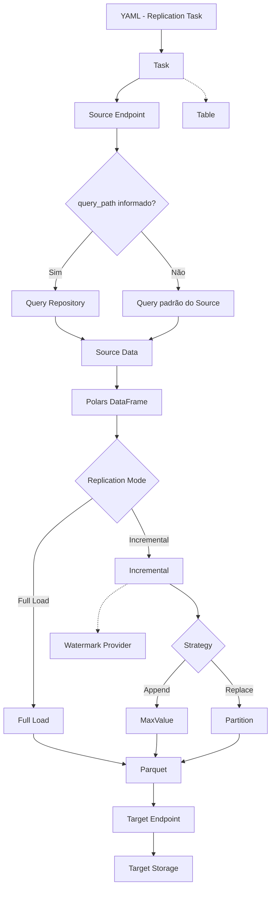

# MANIFEST

Este documento descreve a arquitetura, o domínio e o roadmap do METRO. Para instalar e executar, use o [README.md](README.md).

O METRO é um motor de **Full Load e Incremental Load** orientado à materialização de datasets em Parquet. Substitui a replicação transacional baseada em CDC (como no TREMpy anterior: replication slots, RabbitMQ, replicação entre SGBDs). Esses mecanismos não fazem parte do escopo.

## Princípios

- Python e Polars no core; Parquet na persistência.
- Sources SQL e NoSQL; Targets iniciais Local e S3.
- Dois modos: Full Load e Incremental (Append/MaxValue ou Replace/Partition).
- Sem banco auxiliar no METRO. Watermark e secrets vêm de providers externos.
- Queries fora do YAML. Source extrai e prepara; o METRO replica e materializa.
- Execução local no desenvolvimento; Docker/ECS só como empacotamento, não como requisito do core.

---

# Fluxo de Execução



---

# Source Endpoints

O METRO é projetado para **SGBDs SQL e NoSQL** como fontes:

```text
Source Endpoint
├── SQL — PostgreSQL, SQL Server, Oracle
└── NoSQL — MongoDB
```

O Source é responsável por conexão, autenticação, execução da consulta, paginação, resolução de `query_path` (ou query padrão), obtenção dos dados e conversão para Polars.

O core não interpreta a estrutura de um documento NoSQL. Transformações específicas da fonte (SQL ou aggregation pipeline) acontecem na consulta, antes dos dados chegarem ao METRO.

# Target Endpoints

O Target materializa os dados. A primeira versão:

```text
Target Endpoint
├── S3
└── Local
```

Outros storages podem ser adicionados sem alterar o core. Persistência: **Parquet**. Escrita atômica via pasta `_tmp` — o dataset só é promovido ao final.

# Polars

Polars é o núcleo de representação e processamento. O fluxo conceitual:

```text
Source → Source Data → Polars DataFrame → Replication → Parquet
```

Não existem entidades de domínio `Row` ou `Document`. Diferenças entre SQL e NoSQL não são abstraídas pelo core: cada Source entrega um DataFrame.

# Table

`Table` é identidade e metadados do dataset — não a representação física de cada registro. Metadados de colunas ficam a cargo do Source (ex.: `information_schema` em SQL). Em NoSQL, `name` pode representar uma collection.

```text
Table
├── schema_name
├── name
├── target_schema_name
└── target_name
```

# Query Path

O YAML referencia a consulta; o conteúdo fica no Query Repository.

```yaml
source:
  type: postgresql
  runtime: customer_postgres_database
  query_path: orders.sql    # ou orders.js no MongoDB
```

```text
YAML (query_path) → Query Repository (Local | S3) → arquivo → Source Endpoint
```

Onde as queries são armazenadas é configuração do METRO, não da tarefa. Isso permite `.sql` / `.js` fora do contrato e deixa o core agnóstico ao modelo da fonte. Sem `query_path`, o Source monta a query padrão da tecnologia.

# Replication Strategies

Dois modos. O método incremental é implícito pelo `type` — não existe campo `method` no YAML.

```text
Replication
├── Full Load
└── Incremental
    ├── Append → MaxValue
    └── Replace → Partition
```

Particionamento Hive (`year` / `month` / `day`) é opcional no Full Load e no Append, e **obrigatório** no Replace.

## Full Load

Ingestão completa do dataset. Particionamento opcional em `replication.partition`.

## Incremental — Append / MaxValue

Usa o maior valor da coluna de referência (`MAX(reference_column)`) como watermark. Sem watermark, extrai o dataset completo e cria o valor inicial; nas execuções seguintes filtra `reference_column > watermark`. O watermark só atualiza depois do commit no Target. Hive é opcional (`strategy.partition`). Depende da Watermark API no ar.

## Incremental — Replace / Partition

Reconstrói partições inteiras (Hive-style), não a tabela toda. `lookback_periods` define quantas partições recentes o Target remove e regrava.

```yaml
replication:
  mode: incremental
  strategy:
    type: replace
    reference_column: created_at
    lookback_periods: 3
    partition:
      type: year
```

# Watermark

O METRO não tem banco auxiliar. O estado do Append vem de uma **API HTTP externa**, via `WatermarkClient`:

```text
METRO → WatermarkClient (HTTP) → Watermark API → PostgreSQL (infra do serviço)
```

O PostgreSQL pertence ao serviço de watermark, não ao METRO. No desenvolvimento local a API vive em `.watermark/` e o database é `metro_watermark`.

# Runtime e Secret Provider

`runtime` é a referência à configuração externa do Endpoint. Sources de banco usam `<nome>_<database_type>_database`. Credenciais não entram no YAML.

```yaml
source:
  type: postgresql
  runtime: customer_postgres_database

target:
  type: s3
  runtime: data_lake
```

O provider é escolhido na inicialização (`metro run --secret-provider local|aws`), não no contrato. O mesmo YAML roda em ambientes diferentes.

```text
runtime: customer_postgres_database
        → Secret Provider (local | aws)
        → Secret externo
```

# Estrutura Base do Projeto

```text
metro/
├── core/          task, table, metadata, endpoint
├── sources/       sql (postgresql, sqlserver; oracle futuro) e nosql (mongodb futuro)
├── targets/       local (s3 futuro)
├── replication/   full_load, incremental/append, incremental/replace
│                  partitioning e writer (Hive compartilhado)
├── watermark/     client HTTP
├── queries/       local (s3 futuro)
├── secrets/       local (aws futuro)
├── settings.py
└── cli/
```

# Roadmap

## Core

- [x] Contratos do domínio (`Task`, `Table`, Endpoints, Strategy)
- [x] `WatermarkClient`
- [x] `SecretProvider`
- [x] `QueryRepository`

## Data Engine

- [x] Polars
- [x] Full Load
- [x] Incremental Append / MaxValue
- [x] Incremental Replace / Partition
- [x] Particionamento Hive compartilhado
- [x] Escrita Parquet (plana e particionada)
- [x] Escrita atômica via `_tmp`

## Sources

- [x] PostgreSQL
- [x] SQL Server
- [ ] Oracle
- [ ] MongoDB

## Targets

- [x] Local
- [ ] S3

## Infraestrutura

- [x] Secret Provider Local (`.env`)
- [x] Query Repository Local (`.metro/queries/`)
- [x] CLI `metro run` (1 tabela por execução)
- [x] Logging em console + arquivo (`logs/`)
- [x] Watermark API (local, PostgreSQL externo)
- [ ] AWS Secrets Manager
- [ ] Docker
- [ ] Execução em AWS ECS

# Status

Fluxos funcionais hoje: **PostgreSQL → Local** e **SQL Server → Local** (Full Load, Incremental Replace/Partition e Incremental Append/MaxValue), via CLI `metro run`.
