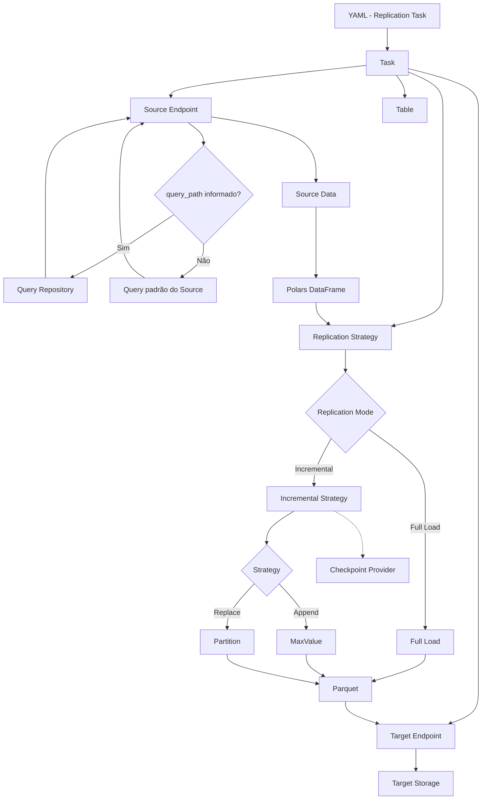

# Fluxo de Execução

O fluxo principal de uma tarefa de replicação pode ser representado da seguinte forma:




# Source Endpoints

O METRO inicialmente será projetado para trabalhar com **SGBDs SQL e NoSQL** como fontes.

Exemplos:

```text
Source Endpoint
│
├── SQL
│   ├── PostgreSQL
│   ├── SQL Server
│   └── Oracle
│
└── NoSQL
    └── MongoDB
```

A implementação específica do Source é responsável por:

- conexão;
- autenticação;
- execução da consulta;
- paginação quando necessária;
- resolução de `query_path`;
- obtenção dos dados;
- conversão dos dados para Polars.

O METRO não é responsável por compreender ou transformar internamente a estrutura de um documento NoSQL.

# Target Endpoints

O Target representa o destino onde os dados serão materializados.

A primeira versão terá suporte a:

```text
Target Endpoint
│
├── S3
└── Local
```

Outros storages poderão ser adicionados posteriormente sem alterar o core de replicação.

O formato de persistência utilizado pelo METRO será **Parquet**.

# Polars

O **Polars** será o núcleo utilizado para representação e processamento dos datasets dentro do METRO.

O fluxo conceitual é:

```text
Source
  ↓
Source Data
  ↓
Polars DataFrame
  ↓
Replication
  ↓
Parquet
```

O METRO não utilizará conceitos como `Row` ou `Document` como entidades do domínio.

Da mesma forma, diferenças entre modelos SQL e NoSQL não serão artificialmente abstraídas pelo core.

Uma fonte NoSQL, por exemplo, poderá utilizar seu próprio mecanismo de consulta para transformar ou explodir documentos antes que os dados sejam entregues ao METRO.

# Table e Column

Apesar de o METRO suportar fontes NoSQL, os conceitos de `Table` e `Column` serão mantidos como parte do domínio.

Eles representam principalmente **identidade e metadados do dataset**, e não a representação física de cada registro.

```text
Table
│
├── schema
├── name
└── columns
    ├── Column
    ├── Column
    └── ...
```

No caso de uma fonte NoSQL, a `Table` pode representar logicamente uma Collection, enquanto o Source Endpoint permanece responsável pelas particularidades da fonte.

# Query Path

O METRO permite que a consulta utilizada pelo Source seja definida externamente ao YAML.

O YAML contém apenas uma referência:

```yaml
source:
  type: postgresql
  runtime: customer_database
  query_path: orders.sql
```

ou:

```yaml
source:
  type: mongodb
  runtime: customer_mongodb
  query_path: orders.js
```

O conteúdo da consulta não é armazenado diretamente no contrato de replicação.

O `query_path` é resolvido pelo **Query Repository**:

```text
YAML
 │
 │ query_path: orders.sql
 ▼
Query Repository
 │
 ├── Local
 │
 └── S3
 │
 ▼
orders.sql
 │
 ▼
Source Endpoint
```

O local onde os arquivos de consulta são armazenados é uma configuração do próprio METRO, e não da tarefa de replicação.

Isso permite que:

- PostgreSQL utilize arquivos `.sql`;
- MongoDB utilize arquivos `.js`;
- consultas complexas sejam mantidas fora do YAML;
- transformações específicas de NoSQL sejam realizadas pela própria consulta;
- o core do METRO permaneça agnóstico ao modelo de dados da fonte.


# Replication Strategies

A replicação é dividida em dois grandes modos:

```text
Replication Strategy
│
├── Full Load
│
└── Incremental
    │
    ├── Append
    │   └── MaxValue
    │
    └── Replace
        └── Partition
```


## Full Load

O **Full Load** realiza a ingestão completa do dataset.

```text
Source
  ↓
Polars
  ↓
Parquet
  ↓
Target
```


## Incremental — Append / MaxValue

A estratégia `Append` utiliza uma coluna de referência para identificar novos dados.

Exemplos de colunas:

```text
created_at
updated_at
id
sequence
```

O METRO pode determinar o maior valor existente:

```text
MAX(reference_column)
```

e utilizar esse valor como ponto de referência para a próxima execução.

Exemplo:

```yaml
replication:
  mode: incremental

  strategy:
    type: append
    method: max_value
    reference_column: updated_at
    aggregation: max
```


## Incremental — Replace / Partition

A estratégia `Replace` permite reconstruir uma ou mais partições do dataset.

Por exemplo:

```text
orders/
├── year=2024/
├── year=2025/
└── year=2026/
```

Caso a partição de 2026 precise ser reconstruída:

```text
1. Identificar a partição
2. Remover os objetos correspondentes
3. Realizar nova extração
4. Gerar novos Parquet
5. Gravar novamente a partição
```

Exemplo:

```yaml
replication:
  mode: incremental

  strategy:
    type: replace
    method: partition
    reference_column: created_at

    partition:
      type: year
```


# Checkpoint

O METRO não possui um banco de dados auxiliar próprio.

O estado necessário para estratégias incrementais, como watermarks, pode ser obtido através de um componente externo denominado **Checkpoint Provider**.

```text
METRO
  │
  ▼
Checkpoint Provider
  │
  ├── API
  ├── Local
  └── outras implementações futuras
```

Por exemplo:

```text
METRO
  │
  ▼
Checkpoint API
  │
  ▼
PostgreSQL
```

O PostgreSQL, nesse caso, pertence à infraestrutura do serviço de checkpoint e **não ao METRO**.

Essa separação permite que o motor permaneça desacoplado de qualquer banco de dados auxiliar.

# Runtime

Cada Source e Target possui um `runtime`.

O `runtime` representa uma referência à configuração externa necessária para estabelecer a conexão com o Endpoint.

Exemplo:

```yaml
source:
  type: postgresql
  runtime: customer_database

target:
  type: s3
  runtime: data_lake
```

O runtime pode apontar para um secret externo:

```text
runtime: customer_database
             │
             ▼
       Secret Provider
             │
             ▼
      Secret externo
```

O METRO não armazena as credenciais dentro da tarefa de replicação.

# Secret Provider

O mecanismo de resolução dos runtimes é definido durante a inicialização do METRO.

Exemplo local:

```bash
metro run --secret-provider local
```

Exemplo em AWS:

```bash
metro run --secret-provider aws
```

Assim, a mesma tarefa pode ser utilizada em diferentes ambientes:

```text
                 Replication YAML
                        │
                        ▼
              runtime: customer_database
                        │
              ┌─────────┴─────────┐
              │                   │
        secret-provider      secret-provider
             local                 aws
              │                   │
              ▼                   ▼
        Local Secrets       AWS Secrets Manager
```

O YAML da tarefa permanece agnóstico ao ambiente.

# Exemplos de Contratos de Replicação


## 1. Full Load — PostgreSQL → Local

```yaml
table:
  schema: public
  name: products

source:
  type: postgresql
  runtime: customer_database

target:
  type: local
  runtime: development_storage

replication:
  mode: full_load
```


## 2. Incremental Append — PostgreSQL → S3

```yaml
table:
  schema: public
  name: customers

source:
  type: postgresql
  runtime: customer_database
  query_path: customers.sql

target:
  type: s3
  runtime: data_lake

replication:
  mode: incremental

  strategy:
    type: append
    method: max_value
    reference_column: updated_at
    aggregation: max
```


## 3. Incremental Replace / Partition — NoSQL → S3

```yaml
table:
  name: orders

source:
  type: mongodb
  runtime: customer_mongodb
  query_path: orders.js

target:
  type: s3
  runtime: data_lake

replication:
  mode: incremental

  strategy:
    type: replace
    method: partition
    reference_column: created_at

    partition:
      type: year
```


# Estrutura Base do Projeto

```text
metro/
│
├── core/
│   ├── task
│   ├── table
│   ├── column
│   ├── endpoint
│   └── execution
│
├── sources/
│   ├── base
│   ├── sql/
│   │   ├── base
│   │   ├── postgresql
│   │   ├── sqlserver
│   │   └── oracle
│   │
│   └── nosql/
│       ├── base
│       └── mongodb
│
├── targets/
│   ├── base
│   ├── s3
│   └── local
│
├── replication/
│   ├── base
│   ├── full_load
│   └── incremental/
│       ├── base
│       ├── append/
│       │   └── max_value
│       └── replace/
│           └── partition
│
├── checkpoint/
│   ├── base
│   └── api
│
├── queries/
│   ├── base
│   ├── local
│   └── s3
│
├── parquet/
│
├── filters/
├── transformations/
├── logging/
└── cli/
```


# Configuração de Inicialização

A configuração da execução é separada do contrato de replicação.

Exemplo:

```bash
metro run --secret-provider local
```

ou:

```bash
metro run --secret-provider aws
```

A tarefa permanece a mesma:

```yaml
source:
  type: postgresql
  runtime: customer_database

target:
  type: s3
  runtime: data_lake
```

Isso permite executar o mesmo contrato em diferentes ambientes sem modificar a configuração da replicação.

# Princípios Arquiteturais

O METRO será desenvolvido seguindo alguns princípios:

- **Python como linguagem principal.**
- **Polars como core para datasets/DataFrames.**
- **Parquet como formato de persistência.**
- **SQL e NoSQL como Source Endpoints.**
- **S3 e Local como Target Endpoints iniciais.**
- **Full Load e Incremental Load como estratégias de replicação.**
- **Append/MaxValue e Replace/Partition como estratégias incrementais iniciais.**
- **Nenhum banco de dados auxiliar dentro do METRO.**
- **Checkpoint desacoplado através de provider externo.**
- **Secrets desacoplados através de Secret Providers.**
- **Queries mantidas externamente ao YAML.**
- **Source responsável pela extração e preparação dos dados.**
- **METRO responsável pela replicação e materialização.**
- **Execução local durante desenvolvimento.**
- **Arquitetura preparada para execução containerizada e AWS ECS.**
- **Docker como etapa de maturidade/deploy, não como requisito conceitual do core.**


# Roadmap Inicial


## Core

- [ ] Definição dos contratos do domínio
- [ ] `Task`
- [ ] `Table`
- [ ] `Column`
- [ ] `SourceEndpoint`
- [ ] `TargetEndpoint`
- [ ] `ReplicationStrategy`
- [ ] `CheckpointProvider`
- [ ] `SecretProvider`


## Data Engine

- [ ] Integração com Polars
- [ ] Full Load
- [ ] Incremental Append / MaxValue
- [ ] Incremental Replace / Partition
- [ ] Escrita Parquet


## Sources

- [ ] PostgreSQL
- [ ] MongoDB
- [ ] Outros SGBDs SQL
- [ ] Outros bancos NoSQL


## Targets

- [ ] Local
- [ ] S3
- [ ] Outros Object Storages


## Infraestrutura

- [ ] Secret Provider Local
- [ ] AWS Secrets Manager
- [ ] Checkpoint API
- [ ] Docker
- [ ] Execução em AWS ECS


# Status

> **Projeto em fase de definição arquitetural.**

O METRO é um novo projeto, inspirado na experiência e nos conceitos desenvolvidos anteriormente no TREMpy, mas com uma arquitetura e objetivo diferentes: substituir a replicação transacional baseada em CDC por um motor de **Full Load e Incremental Load orientado à materialização de datasets em Parquet**.

O TREMpy anterior utilizava CDC, replication slots, RabbitMQ e replicação entre SGBDs; esses mecanismos não fazem parte do escopo arquitetural do METRO.